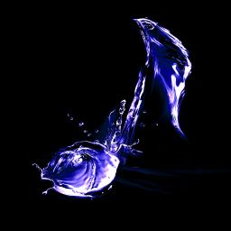

## Welcome to the **JMusicBot** wiki!

[🔢 Setup](setup.md){ .md-button }
[⏰ 24/7 Hosting](hosting.md){ .md-button } 
[📃 Playlists](playlists.md){ .md-button } 
[📜 Full Command Reference](commands.md){ .md-button } 
[⚠ Troubleshooting](troubleshooting.md){ .md-button } 
[📥 Support Server](https://discord.gg/0p9LSGoRLu6Pet0k){ .md-button }
  

## Features
  * Easy to run (just make sure Java is installed, and run!)
  * Fast loading of songs
  * No external keys needed (besides a Discord Bot token)
  * Smooth playback
  * Server-specific setup for the "DJ" role that can moderate the music
  * Clean and beautiful menus
  * Supports many sites, including Youtube, Soundcloud, and more
  * Supports many online radio/streams
  * Supports local files
  * Playlist support (both web/youtube, and local)

## Supported sources and formats
JMusicBot supports all sources and formats supported by [lavaplayer](https://github.com/sedmelluq/lavaplayer#supported-formats):
### Sources
  * YouTube
  * SoundCloud
  * Bandcamp
  * Vimeo
  * Twitch streams
  * Local files
  * HTTP URLs
### Formats
  * MP3
  * FLAC
  * WAV
  * Matroska/WebM (AAC, Opus or Vorbis codecs)
  * MP4/M4A (AAC codec)
  * OGG streams (Opus, Vorbis and FLAC codecs)
  * AAC streams
  * Stream playlists (M3U and PLS)

## Example

## Setup
Please see the [Setup Page](setup.md) in the wiki to run this bot yourself!
